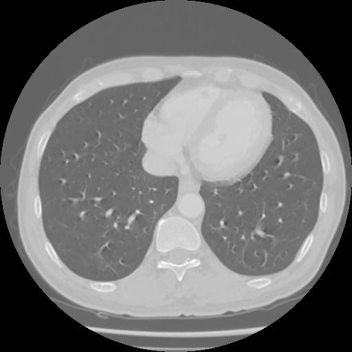

# MRI Autoencoder with U-Net Architecture

This repository contains an implementation of a U-Net based autoencoder for MRI image reconstruction and denoising. The system includes both smaller and larger model variants for different performance requirements.

## Features

- **DICOM Dataset Processing**: Tools for organizing and splitting DICOM datasets into train/val sets
- **U-Net Architectures**:
  - Basic U-Net for image reconstruction
  - Small Reconstructor and Denoiser (smallRD)
  - Large Reconstructor and Denoiser (largeRD)
- **Training Pipeline**: Complete training workflow with validation
- **Inference Tools**: Single image and batch processing capabilities
- **Metrics**: PSNR calculation for quality evaluation

## File Structure

```
.
├── large_denoiser.pth            # Pretrained weights for large denoiser
├── large_reconstructor.pth       # Pretrained weights for large reconstructor
├── mri_autoencoder.ipynb        # Main notebook with all code
├── small.pth                    # Small U-Net weights
├── small_denoiser.pth           # Pretrained weights for small denoiser
├── small_reconstructor.pth      # Pretrained weights for small reconstructor
├── test.dcm                     # Sample DICOM test file
├── test.jpg                     # Sample output image
└── test2.dcm                    # Additional test DICOM file
```

## Usage

### Training

1. Organize your DICOM dataset using the provided splitting tool
2. Run the training cells in the notebook for your desired model:
   - Basic U-Net
   - smallRD (small Reconstructor/Denoiser)
   - largeRD (large Reconstructor/Denoiser)

### Inference

The notebook provides several inference options:

1. **Single Image Inference**:
   ```python
   inference_single_image(MODEL_PATH, TEST_DICOM_PATH)
   ```

2. **Batch Processing**:
   ```python
   batch_inference(MODEL_PATH, INPUT_DICOM_DIR, OUTPUT_DIR)
   ```

3. **Reconstructor-Denoiser Pipeline**:
   ```python
   inference_single_image(RECONSTRUCTOR_PATH, DENOISER_PATH, TEST_DICOM_PATH)
   ```

## Requirements

- Python 3.8+
- PyTorch
- pydicom
- numpy
- matplotlib
- tqdm

## Results

Sample output showing original and reconstructed images with PSNR metrics:



## Pretrained Models

The repository includes several pretrained models:

- `small.pth`: Basic small U-Net
- `small_reconstructor.pth` + `small_denoiser.pth`: Small RD pair
- `large_reconstructor.pth` + `large_denoiser.pth`: Large RD pair

## License

This project is licensed under the MIT License - see the [LICENSE](LICENSE) file for details.

## Acknowledgments

- U-Net architecture based on the original paper by Ronneberger et al.
- DICOM processing tools inspired by various medical imaging projects
